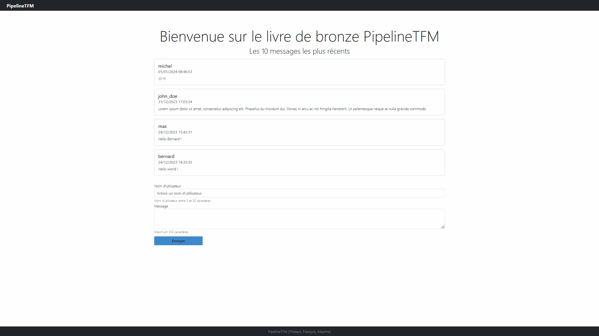
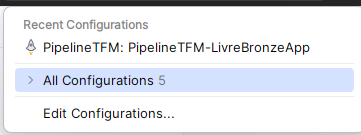

[](https://github.com/UNamurCSFaculty/2324_INFOM126_GROUPE_09/actions)
[](https://sonarqube.thibber.be)
[](https://sonarqube.thibber.be)
[](https://sonarqube.thibber.be)
[](https://sonarqube.thibber.be)
[](https://sonarqube.thibber.be)

# PipelineTFM



## Introduction

PipelineTFM is a simple guest book application based on a template generated using JHipster 8.0.0 and JHipster .Net Core. You can find documentation and help at https://jhipsternet.readthedocs.io/en/latest/index.html and [https://www.jhipster.tech/documentation-archive/v8.0.0](https://www.jhipster.tech/documentation-archive/v8.0.0).

Hello there.

## Prerequisites

In order to run the project, make sure you have these tools installed on your machine:

- [Git](https://git-scm.com/)
- [Node.js](https://nodejs.org/)
- [.NET 7.0](https://dotnet.microsoft.com/en-us/download/dotnet/7.0)
- [Docker](https://www.docker.com/products/docker-desktop/)
- [Angular CLI](https://github.com/angular/angular-cli)
- Jetbrains Rider or Visual Studio

## Project setup

1. Clone the repository

```bash
git clone https://github.com/UNamurCSFaculty/2324_INFOM126_GROUPE_09.git
```

2. Install Node dependencies in the root folder and in `src/PipelineTFM/ClientApp`

```bash
npm install
cd src/PipelineTFM/ClientApp
npm install
```

3. Deploy the PostgreSQL database Docker container and make sure it's running

```bash
docker compose -f docker/postgresql.yml -p pipelinetfm up -d
```

4. Open the solution in Jetbrains Rider or Visual Studio

5. Run the `PipelineTFM: PipelineTFM-LivreBronzeApp` configuration



## Testing

### Client tests

Unit tests are run by Jest. They're located in [src/PipelineTFM/ClientApp/test/](src/PipelineTFM/ClientApp/test/) and can be run with:

```bash
npm test
```

### .NET Backend tests

To launch application's tests, run:

```bash
dotnet test --verbosity normal
```

or to check the coverage (C# backend only, `PipelineTFM.Crosscutting` and `PipelineTFM.Dto` are excluded from coverage)

```bash
dotnet test -p:CollectCoverage=true --no-build --verbosity normal test/PipelineTFM.Test/
```

## Code style / formatting

### .NET Format

To format the dotnet code, open a terminal in the project root and run

```bash
dotnet format
```

or if you only want to check the format status

```bash
dotnet format --verify-no-changes
```

### Client format

To format the web app code, open a terminal in the `src/PipelineTFM/ClientApp` folder and run

```bash
npm run prettier:format
```

or if you only want to check the format status

```bash
npm run prettier:check
```

However, the SonarQube quality gate doesn't check every file. If you want to use the format check, you can run

```bash
npm run prettier:check-ci
```

## Code quality

A Docker Compose file for SonarQube is provided to deploy your own instance.

Manually (using bash):

1. Run Sonar in container : `docker compose -f ./docker/sonar.yml up -d`

2. Install Sonar scanner for .NET : `dotnet tool install --global dotnet-sonarscanner`

3. Run ``dotnet sonarscanner begin -d:sonar.login=admin -d:sonar.password=admin -key:"PipelineTFM" -d:sonar.host.url="http://localhost:9001" -s:"`pwd`/SonarQube.Analysis.xml"``

4. Build your application : `dotnet build`

5. Publish sonar results : `dotnet sonarscanner end -d:sonar.login=admin -d:sonar.password=admin`

6. Go to http://localhost:9001

## Building for production

### .NET Production builds

To build the artifacts and optimize the PipelineTFM application for production, run:

```bash
cd ./src/PipelineTFM
rm -rf ./src/PipelineTFM/wwwroot
dotnet publish --verbosity normal -c Release -o ./app/out ./PipelineTFM.csproj
```

The `./src/PipelineTFM/app/out` directory will contain your application dll and its depedencies.

### Build a Docker image

You can also fully dockerize the application and all the services that it depends on. To achieve this, run:

```bash
docker compose -f ./docker/app-prod.yml build
```

and then

```bash
docker compose -f ./docker/app-prod.yml up
```

Go to http://localhost:5000

## Further Documentation and Resources

For more detailed documentation on our project, visit our [documentation page](https://unamurcsfaculty.github.io/2324_INFOM126_GROUPE_09/). Here, you'll find comprehensive guides, API references, and other resources to help you understand and work with our project effectively.
